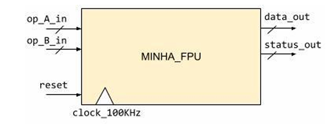

# FPU
Esse projeto tem como objetivo entender o papel do padrão IEEE-754 em projetos de hardware de unidades de ponto-flutuante (FPU's). O desafio foi formatar nossos próprios operandos de acordo com a nossa matrícula.

## Interface:

|    **Sinal**   |   **Direção**   |                 **Descrição**                |
|----------------|-----------------|----------------------------------------------|
|  `clock_100k`  |      Input      |   Clock de 100KHz                            | 
|  `reset`       |      Input      |   Reset assíncrono-baixo                     |
|  `op_a e op_b` |      Input      |   Operandos da soma/subtração                | 
|  `data_out`    |      Output     |   Resultado da Operação                      | 
|  `status_out`  |      Output     |   Informação do resultado no estilo one-hot  | 

## Operandos op_a e op_b:
- Os operandos foram customizados com a nossa matrícula da seguinte forma:

### Primeiro: 
- Os operandos foram divididos da seguinte forma:

| **Sinal(+ ou -)** |  **Expoente**   |   **Mantissa**   |   
|-------------------|-----------------|------------------|
|        `1`        |       `X`       |       `Y`        | 

### Segundo:

- Para determinar o x foi utilizado o seguinte cálculo:

               X = [8 (+/-) ∑b mod 4] 
  
- Onde ∑b representa a soma de todos os dígitos do número de matrícula (base 10) e mod 4 
representa o resto da divisão inteira por 4. O sinal + ou - é determinado pelo dígito 
verificador do número de matrícula: + se for ímpar, - se for par.

- E para determinar o Y foi utilizado o seguinte cálculo:

                        Y = 31 - X.

- Então, de acordo com a minha mátricula (24102913-1) foi calculado da seguinte forma:

      X = [8 + (2+4+1+0+2+9+1+3+1) mod 4] = [8 + 23 mod 4] = [8 + 3] = 11
      Y = [31 - 11] = 20
  
- Dessa forma meus operandos ficaram no seguinte formado:

| **Sinal(+ ou -)** |  **Expoente**   |   **Mantissa**   |   
|-------------------|-----------------|------------------|
|        `1`        |       `11`      |       `20`       | 

## Como funciona :

A FPU foi programada com uma máquina de estados que são :  DIVIDE, PRE_ADD, WAIT_PRE_ADD, ADD, WAIT_ADD, NORMALIZER, ROUNDING, OUTPUT_RESULT; 

A máquina inicializa os sinais, registradores e as flags (que serão usadas no status out). Ela passa para o estado `DIVIDE`, onde ele recebe os operandos com os números padronizados e "desmancha" eles em sinal, expoente e mantissa. Após, vai para o estado `PRE_ADD` que verifica os expoentes, se os expoentes forem iguais, então, vai para o estado `WAIT_PRE_ADD`, se não ele faz com que os operandos fiquem com o mesmo expoente "shiftando" o operando com o menor expoente. Após, vai para o estado `WAIT_PRE_ADD`, para passar o expoente escolhido para o expoente final. Depois, vai para o estado `ADD`, onde ocorre a soma/subtração que depende dos sinais, pois, se os sinais forem iguais ele soma de forma direta, se não ele compara as mantissas para fazer subtração da maior mantissa pela menor mantissa, e o sinal do resultado será o do maior em módulo. Novamente, vai para um estado para definir a mantissa e o sinal final, ou seja, o `WAIT_ADD`. O estado muda para o `NORMALIZER` que faz o papel de shiftar de volta a diferença que teve de fazer para a soma das mantissas no estado `PRE_ADD`. No penúltimo estado, `ROUNDING`, serve para ajustar o resultado final do operando, garantindo que a mantissa esteja normalizada e que o expoente seja ajustado corretamente, além de levantar as flags para `overflow`, `underflow`, `exact` e `inexact`. E finalmente, no estado `OUTPUT_RESULT`, é aonde junta o `sinal final`, o `expoente final` e a `mantissa final`.

## Descrição do espectro espectro numérico representável pela FPU de padrão customizado:

- Representação decimal:
  
| ||||| ||| | |  |    |         |---------------------------> 

0 1   2  3 ... 10   100   1.0e3   ...        1.0e6   ...   1.0e308

- Representação binária:                          

| ||||| ||| | |   |        |------------------------------->   
0 2⁻²⁰ 2⁻¹⁹ ... 1   2   4   8   16   ...   2²⁰⁴⁷               

## Como simular
Para simular a FPU , entre na pasta `TB/` e então utilize o comando `do sim.do` para simular. 

